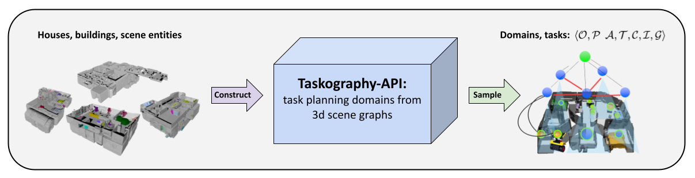

# taskography-api
A simple API for sampling symbolic planning tasks in large-scale 3D scene graphs.



---


## Overview
This repository corresponds to Taskography-API as described in *Taskography: Evaluating robot task planning over large 3D scene graphs*, presented at CoRL2021: [project page](https://taskography.github.io/), [paper link](https://www.chrisagia.com/papers/Taskography-CoRL-2021.pdf). We provide support for the following:

- **Hierarchical-Symbolic Graph Construction.** 
The raw [Gibson](https://3dscenegraph.stanford.edu/database.html) scene graph data is [loaded](https://github.com/taskography/taskography-api/blob/main/taskography_api/taskography/utils/loader.py#L8) from its `.npz` file format encoding before [heuristically](https://github.com/taskography/taskography-api/blob/main/taskography_api/taskography/samplers/task_sampler_base.py) determining the inter-layer and intra-layer connectivity structure of the scene.
- **Task Sampling.** [Problem samplers](https://github.com/taskography/taskography-api/tree/main/taskography_api/taskography/samplers/domains) for auto-generating [PDDLGym](https://github.com/tomsilver/pddlgym) domains of increasing complexity: `Rearrangement(k)`, `Courier(n,k)`, `Lifted Rearrangement(k)`, `Lifted Courier(n,k)`, as introduced in our paper. Each task sampler is modifiable to the degree literal goal conjuctions (k), and for Courier domains, stow capacity (n).
- **Trajectory Sampling.** Scripts for generating datasets of symbolic state-action trajectories atop PDDLGym environments leveraging your choice of [PDDL planner](https://github.com/agiachris/pddlgym_planners); for purposes of training neurosymbolic learning-to-plan algorithms.
- **Environment Wrappers.** 
Gym wrappers enabling symbolic interaction with 3D scene graphs - in support of online decision making algorithms and reinforcement learning methods. 


## Setup
Add setup steps.

Pip installed without editable. 
- third_party/pddlgym_planners


Pip installed with editable.
- third_party/pddlgym


### Requirements
This is the easy part.

## Instructions 


### Basic Usage
Add simple usage examples.


### Extended Usage
Add tips for extended usage.


## Citation
Taskography-API has an MIT [License](https://github.com/taskography/taskography-api/blob/main/LICENSE). If you find this package helpful, please consider citing our work:

```
@inproceedings{agia2022taskography,
  title={Taskography: Evaluating robot task planning over large 3D scene graphs},
  author={Agia, Christopher and Jatavallabhula, Krishna Murthy and Khodeir, Mohamed and Miksik, Ondrej and Vineet, Vibhav and Mukadam, Mustafa and Paull, Liam and Shkurti, Florian},
  booktitle={Conference on Robot Learning},
  pages={46--58},
  year={2022},
  organization={PMLR}
}
```


## References
We would like to credit the developers of several very useful packages.

- [1] "PDDLGym: Gym Environments from PDDL Problems," Tom Silver, Rohan Chitnis, [link](https://github.com/tomsilver/pddlgym) to repository.
- [2] "PDDLGym Planners: Lightweight Python interface for using off-the-shelf classical planners," Tom Silver, Rohan Chitnis, [link](https://github.com/ronuchit/pddlgym_planners) to repository.